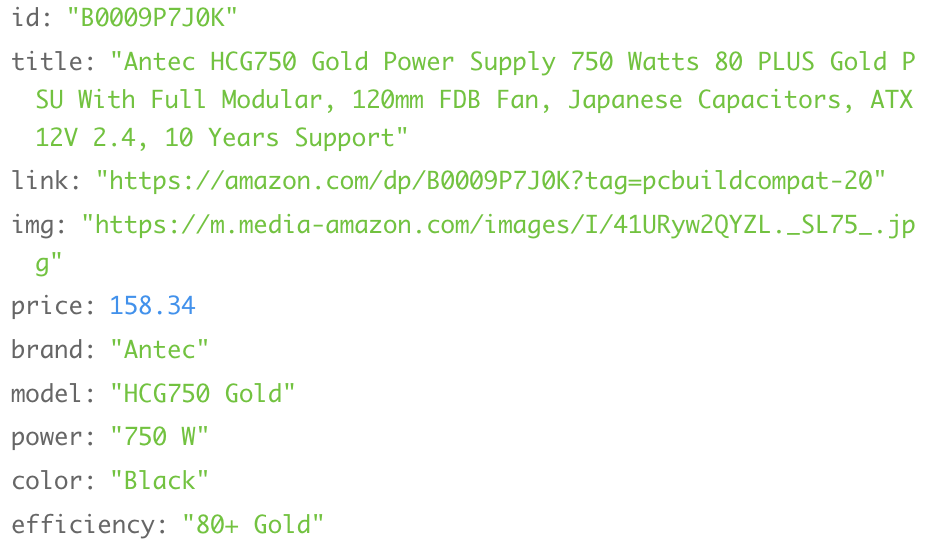

<h1>PROJECT 3</h1>

<h1>Com Parts</h1>
For this project, I wanted to make a e-commerce site using the MERN stack that sells computer parts for custom builds and general use. 

I was able to use a third-party REST API called Computer Components API that provide multiple endpoints to fetch computer parts, like ram, GPU, CPU processors, etc. 

<h2>API</h2>
<h3>URL</h3>

```
https://computer-components-api.p.rapidapi.com/{product}?limit={limit}&offset={offset}
```

<h4>Parameters</h4>
{product} = product type like ram, storage, etc.</br>
{limit} = number of products displayed on the page at one given.</br>
{offset} = the number of results to be skipped</br>
</br>
<h4>API Object Structure</h4>


Above is how one project for a power supply is structure. There are common keys such as title, img and price and keys unqiue to the product: For example, power and efficiency are unique to the power supply.

<h2>Organization</h2>
With the concept of separation of concern in mind, I organized, first between Frontend and Backend and then between different components. 
</br>
<h3>Backend file structure</h3>

```
config
  checkToken.js
  database.js
  ensureLoggedIn.js
controller
  api
    users.js
models
    users.js
routers
  api
    users.js

```
  
<h3>Frontend folder Structure</h3>

Each folder holds a js file that deals with its concern as labeled by its name. 

```
src
  components
    Footer
    LoginForm
    LogOut
    NavBar
    SideBar
    SignUpForm
  pages
    App
    Auth
    Cart
    CaseFans
    Cases
    CpuFans
    Gpu
    Home
    Motherboard
    Mouse
    OrderHistory
    PowerSupply
    Processor
    Ram
    Storage
    Wishlist
```
<h3>API Helpers / Services</h3>

The js files below were created to help make fetch calls to the backend. These files were put into the utilities folder.

```
utilities
  send-request.js
  users-api.js
  users-services.js
```

<h4>Main Page</h4>

[Input Main page image]

I wanted to construct the Main Page into four main components: NavBar, SideBar, Footer and a Category Section which displays the product, divided among its type. 

